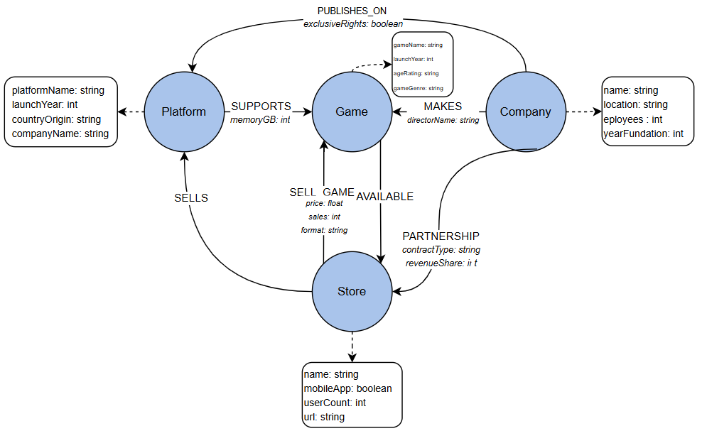
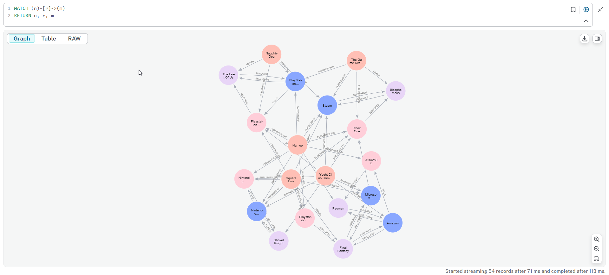

# Introducción a Neo4j 🚀

Diseñando una base de datos básica enfocada en 🎮 juegos, 🖥️ plataformas, 🏢 empresas y 🛒 tiendas.  

Los queries necesarios para esta base de datos se encuentran en los archivos `.cql`, dentro de la carpeta `lab1`.  

## 📝 Diagrama del Diseño
  
  

## 📊 Resultados  

🔍 **Ejemplo de consulta ejecutada:**  
  
