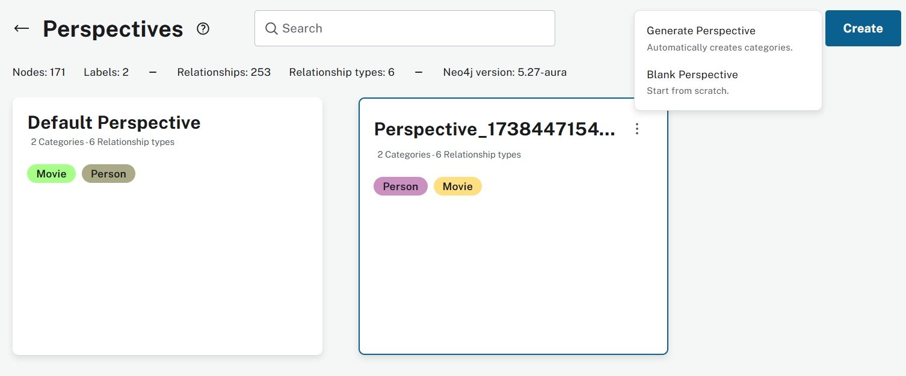
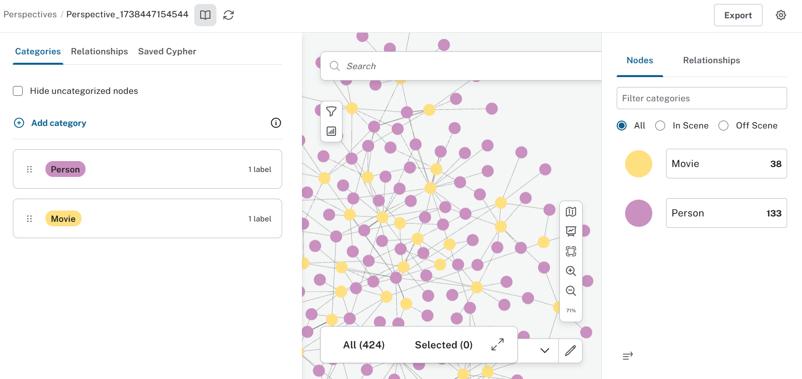
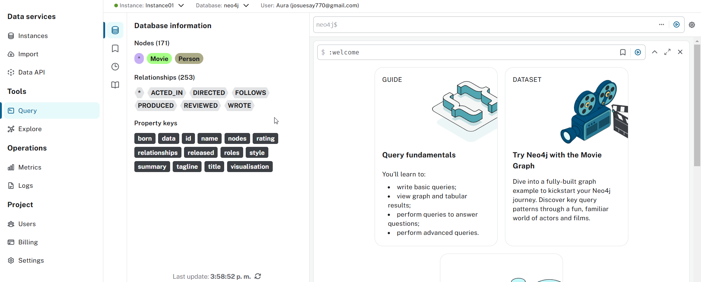

# Neo4j Cypher 📌

## 🔍 Perspectivas

Neo4j Bloom permite obtener vistas o [perspectives](https://neo4j.com/docs/bloom-user-guide/current/bloom-perspectives/) utilizando código y opciones sin código. Esto facilita a los desarrolladores y personas con objetivos empresariales visualizar los datos de manera intuitiva.

Con esta herramienta, se pueden crear relaciones de interés, así como nodos obtenidos de una instancia de Neo4j.

Para ello, se puede utilizar la opción "Explorer" dentro de la instancia, que generará automáticamente una "Default Perspective". Sin embargo, también es posible crear perspectivas automáticas o en blanco, seleccionando manualmente los datos y configuraciones necesarias.

### 🎯 Generación de Perspectivas

- **📊 Generar Perspectiva:** Bloom analiza la base de datos para identificar etiquetas y categorías óptimas, generando automáticamente la perspectiva con los datos relevantes.
- **⚪ Perspectiva en Blanco:** Permite crear una perspectiva desde cero, definiendo manualmente cada categoría y sus propiedades.

Usar una u otra opción dependerá del tamaño de la base de datos y la necesidad de personalización. Si la base de datos tiene más de **10 millones de nodos y relaciones**, un escaneo completo puede tardar, por lo que se recomienda usar un escaneo rápido.

### 🎨 Personalización con Perspective Designer

A través de la opción **Perspective Designer**, se pueden configurar vistas, habilitar o deshabilitar etiquetas de nodos, gestionar relaciones y diseñar consultas personalizadas.

#### 🔹 Búsquedas y Acciones en la Vista

- **📌 Saved Cypher "Search Phrases"**: Permite guardar consultas con descripciones y parámetros dinámicos, como un filtro por precio.
- **⚡ Scene Actions**: Agrega acciones especiales sobre los nodos visibles, como expandir relaciones con un clic derecho. Por ejemplo, en una instancia de productos y compras, se puede crear la acción **"Show Orders"** para visualizar las órdenes de compra asociadas a un cliente.

🔗 [Ejemplo en video](https://www.youtube.com/watch?v=-7VOIX7YtB4&t=234s)

---

## 📝 Consultas (Querys)

Utilizando una instancia de Neo4j, se aplicó un dataset propio de Neo4 para crear un grafo de **Person - Movie**, y ejecutando diversas consultas de la carpeta `/labs/lab2`.

### 📂 Estructura de archivos

- **Parte1.md** → Análisis de los datos iniciales.
- **Parte2.cql** → Creación de nodos adicionales y prácticas de sintaxis unificada.
- **Parte3.cql** → Consultas, actualizaciones, agregaciones y eliminaciones de datos.

Para repetir el proceso, solo es necesario crear la base de datos con la misma plantilla de Neo4j ejcuanto los querys necesarios y probar los scripts `.cql` de esta carpeta.
