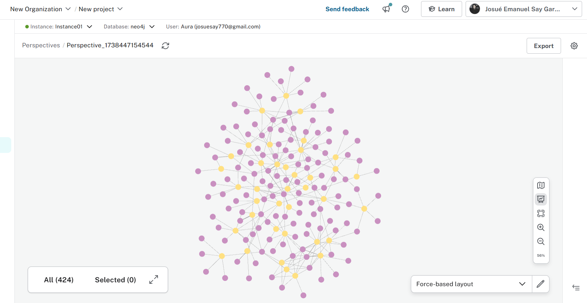

# Parte 1 - Análisis General

Usando la herramienta *Perspectives* en la sección *Explorer* se obtuvo el siguiente grafo:

1. **¿Qué opiniones tiene sobre este grafo?**  
   1.1. Este grafo permite hacer una comparación entre la proporción de películas y personas. Se observa que hay más nodos de personas (morado) que de películas (amarillo), lo cual es un resultado esperado, ya que para realizar una película se necesita la participación de muchas personas. Al hacer zoom en el grafo, se pueden visualizar con mayor detalle las relaciones entre las personas y las películas.  

2. **¿Considera que puede sacar algunas conclusiones sobre las relaciones visualizadas? En caso contrario, ¿por qué? ¿Qué necesitaría para sacar conclusiones?**  
   2.1. Sí, es posible obtener conclusiones sobre el significado de las relaciones observando el grafo. Además, al visualizar todas las conexiones sin el modo de presentación, se pueden identificar relaciones como **ACTED_IN, DIRECTED, FOLLOWS, PRODUCED y REVIEWED**, lo que permite saber qué personas están vinculadas a cada película y su rol en dicha película.
   2.2. Sin embargo, el grafo proporciona solo una vista general, ya que representa toda la instancia de personas y películas abarcando las seis relaciones existentes. Para obtener conclusiones más específicas, sería necesario realizar consultas adicionales que busquen información detallada, como identificar cuántas personas han tenido múltiples roles en una misma película o en varias. Por ejemplo, se podría analizar qué personas han participado en una película en diferentes roles como **ACTED_IN, DIRECTED, FOLLOWS, PRODUCED y REVIEWED**.  

3. **Analice el propósito de explorar información de esta manera**  
   3.1. Se investigó previamente sobre **Perspectives** y se documentó en el README del repositorio. Según la documentación de Neo4j, la herramienta **Perspectives** proporciona una vista empresarial dirigida a un público específico, incluyendo desarrolladores, sin necesidad de implementar código (aunque la opción está disponible). Su propósito es permitir la exploración y análisis de datos dentro de una instancia de Neo4j de manera intuitiva. Esto facilita que analistas o responsables de la toma de decisiones puedan obtener información útil y definir estrategias para un negocio sin necesidad de conocimientos avanzados en programación, optimizando el uso de la base de datos.
