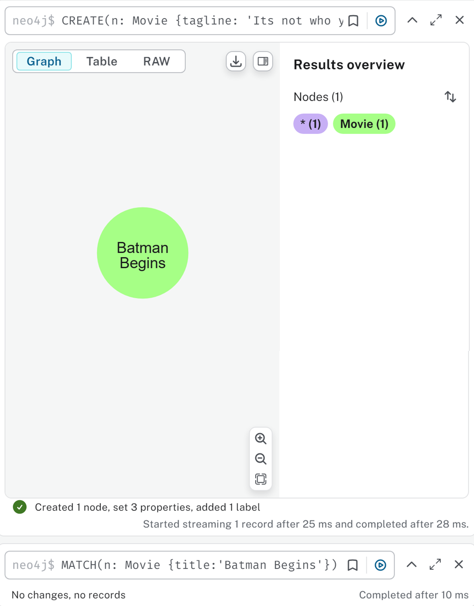
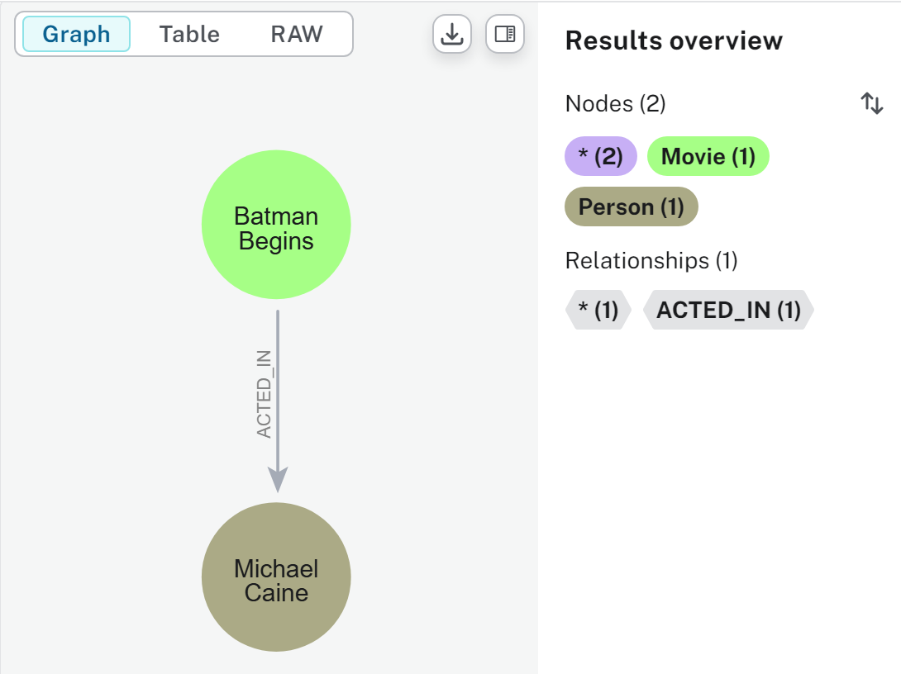
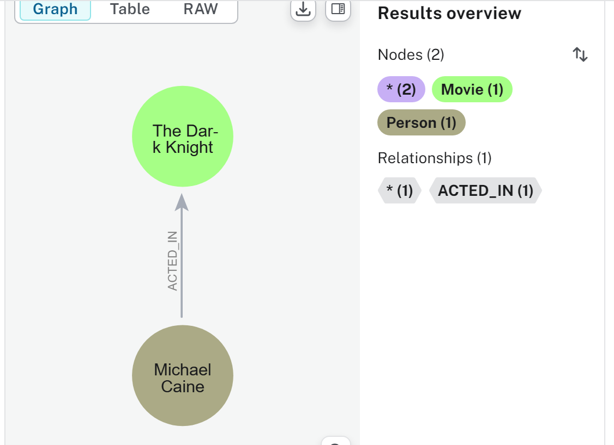
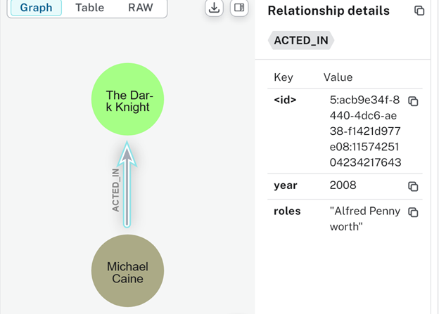
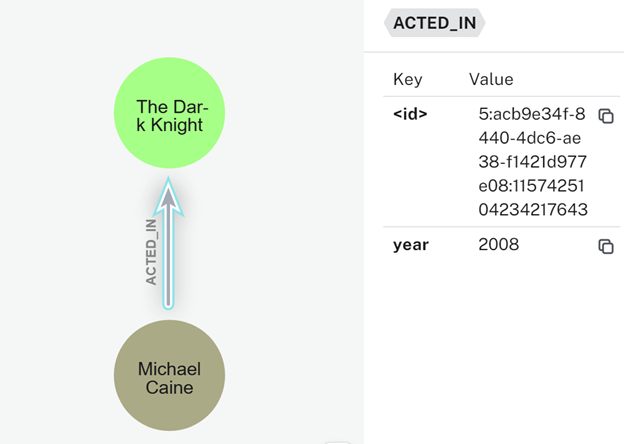
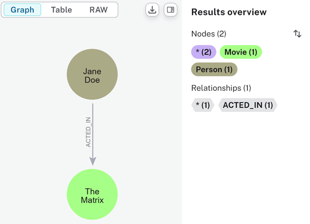
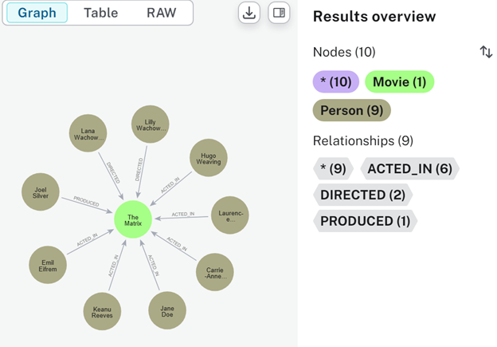
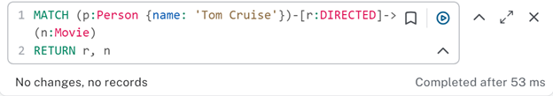
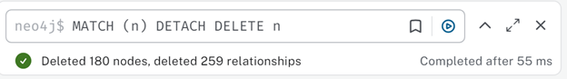
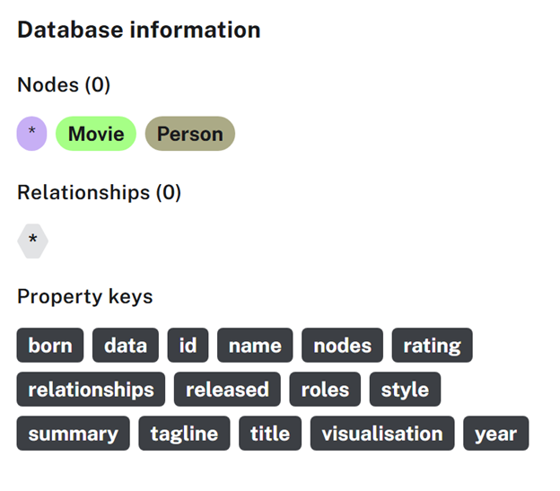

# Parte 3 - Consultar datos con Cypher

**Nodo Batman Begins**

**Nodo The Dark Knight**

**Relacion The Dark Knight**

**Eliminar propiedad de Actor en The Dark Night**

**Nodo Jane Doe**

**Personas relacionadas con The Matrix**

**Todas las relaciones de Tom Cruise con películas**

**Eliminación de todo**

