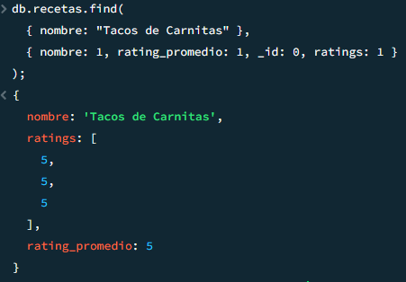

---
header-includes:
  - \usepackage{float}
  - \usepackage{fontspec}
  - \setmainfont{FiraCode Nerd Font}
  - \usepackage{setspace}
  - \setstretch{1.5}
  - \usepackage{fvextra}
  - \DefineVerbatimEnvironment{Highlighting}{Verbatim}{breaklines,commandchars=\\\{\}}
geometry: top=0.67in, bottom=0.67in, left=0.85in, right=0.85in
---

# Laboratorio 05 - Introducción a MongoDB

## Integrantes

- Abby Donis - 22440
- Mathew Cordero - 22982
- Josué Say - 220801

## Ejercicio 1 - Preparación de ambiente

### 1.1 Crear la base de datos `lab05` en MongoDB Atlas

- Ingrese a su cuenta de MongoDB Atlas.
- Desde la interfaz gráfica de MongoDB Atlas, cree una nueva base de datos llamada `lab05`.

  { height=150px }

  { height=150px }

### 1.2 Obtener la URI de conexión

- Obtenga la URI de conexión de su base de datos en MongoDB Atlas.
  
  { height=250px }

### 1.3 Crear las colecciones `recetas` y `usuarios`

- Desde su IDE NoSQL, cree las colecciones `recetas` y `usuarios` dentro de la base de datos `lab05`.

  

### 1.4 Importar los datos a las colecciones

- Desde su IDE, importe los datos correspondientes a las colecciones `recetas` y `usuarios` en su base de datos `lab05`.

  | Imagen | Descripción |
  |--------|-------------|
  |  | Importación de datos de la colección `recetas`. |
  |  | Importación de datos de la colección `usuarios`. |

## Ejercicio 2 - Exploración y manipulación de datos

### 2.1 Crear una consulta para obtener todas las recetas

- Realice una consulta en MongoDB para obtener todos los documentos de la colección `recetas`.

  ```javascript
  db["recetas"].find();
  ```

  { height=250px }

### 2.2 Crear una consulta para obtener todos los usuarios

- Realice una consulta en MongoDB para obtener todos los documentos de la colección `usuarios`.

  ```javascript
  db["usuarios"].find();
  ```

  { height=250px }

### 2.3 Crear un nuevo documento en la colección `recetas`

- Con base en la estructura observada en la colección `recetas`, cree un nuevo documento que contenga los siguientes campos:
  - Titulo, Descripción, Tiempo de Cocción, Etc

- Si se usa el documento JSON el documento ya existe por lo que se puede usar el siguiente comando para eliminarlo y volverlo a crear

  ```javascript
  db["recetas"].deleteOne({ _id: "6" });
  ```

- Luego creamos la nueva receta:

  ```javascript
  db["recetas"].insertOne({
    _id: "6",
    nombre: "Tacos de Carnitas",
    descripcion:
      "Tacos tradicionales mexicanos con carne de cerdo cocida lentamente hasta quedar dorada y jugosa.",
    "tiempo total minutos": 180,
    Porciones: 6,
    calorias: "500",
    dificultad: "Media",
    vegetariana: false,
    ingredientes: [
      { nombre: "carne de cerdo (pierna o lomo)", cantidad: "1 kg" },
      { nombre: "naranja", cantidad: "1 unidad (jugo)" },
      { nombre: "ajo", cantidad: "3 dientes" },
      { nombre: "hoja de laurel", cantidad: "1 unidad" },
      { nombre: "sal", cantidad: "1 cucharada" },
      { nombre: "pimienta negra", cantidad: "1 cucharadita" },
      { nombre: "comino", cantidad: "1 cucharadita" },
      { nombre: "agua", cantidad: "500 ml" },
      { nombre: "tortillas de maíz", cantidad: "12 unidades" },
      { nombre: "salsa verde o roja", cantidad: "al gusto" },
    ],
    preparación: [
      "Corta la carne de cerdo en trozos medianos y colócala en una olla grande.",
      "Añade el jugo de naranja, los ajos enteros, la hoja de laurel, sal, pimienta y comino.",
      "Vierte el agua hasta que la carne quede cubierta y cocina a fuego medio hasta que el agua se evapore (aproximadamente 1.5 horas).",
      "Una vez que el agua se haya evaporado, deja que la carne se dore en su propia grasa hasta que esté bien dorada y crujiente.",
      "Retira la hoja de laurel y desmenuza ligeramente la carne con un tenedor.",
      "Calienta las tortillas de maíz en un comal y arma los tacos con la carne de carnitas.",
      "Decora con cebolla picada, cilantro y salsa al gusto. ¡Disfruta!",
    ],
    ratings: [5, 5],
    rating_promedio: 4.0,
  });
  ```

  { height=150px }

### 2.4 Crear una consulta que busque la receta que acaba de crear

- Realice una consulta para buscar el documento de la receta que acaba de agregar.

  ```javascript
  db.recetas.find({ nombre: "Tacos de Carnitas" });
  ```

  { height=260px }

### 2.5 Crear una consulta en la que liste las recetas, mostrando únicamente el título y su tiempo de cocción

- Realice una consulta que liste solo los campos `título` y `tiempo de cocción` de todas las recetas.

  ```javascript
  db.recetas.find(
    {},
    { "Titulo Receta": "$nombre", "Tiempo Coccion": "$tiempo total minutos" }
  );
  ```

  { height=180px }

### 2.6 Crear una consulta en la que se listen las recetas ordenadas por mayor tiempo de cocción

- Realice una consulta que liste las recetas, ordenadas de mayor a menor según el `tiempo de cocción`.

  ```javascript
  db.recetas
    .find(
      {},
      { "Titulo Receta": "$nombre", "Tiempo Coccion": "$tiempo total minutos" }
    )
    .sort({ "tiempo total minutos": -1 });
  ```

  { height=200px }

### 2.7 Investigar la instrucción `update()` para agregar un rating más a una receta y actualizar el rating promedio

- Investigue la instrucción `update()` en MongoDB y cree una consulta que agregue un nuevo `rating` a una receta, y actualice el `rating promedio` de la receta.

  ```javascript
  db.recetas.updateOne(
    { nombre: "Tacos de Carnitas" },
    {
      $push: { ratings: 5 },
      $set: {
        rating_promedio: 5,
      },
    }
  );
  ```

- Comprobando el resultado:

  ```javascript
  db.recetas.find(
    { nombre: "Tacos de Carnitas" },
    { nombre: 1, rating_promedio: 1, _id: 0, ratings: 1 }
  );
  ```

  { height=200px }

### 2.8 Crear una consulta en la que elimine un ingrediente de la lista de ingredientes de una receta en específico

- Realice una consulta para eliminar un ingrediente específico de la lista de ingredientes de una receta determinada.

  ```javascript
  db.recetas.updateOne(
    { nombre: "Tacos de Carnitas" },
    { $pull: { ingredientes: { nombre: "cilantro" } } }
  );
  ```

- Comprobación de cambios.

  ```javascript
  db.recetas.find({ nombre: "Tacos de Carnitas" });
  ```

  { height=200px }

### 2.9 Investigar la opción `skip()` de la instrucción `find()` y crear una consulta en la que obtenga la tercera receta con mejor rating promedio

- Investigue la opción `skip()` de la instrucción `find()`. Luego, cree una consulta que obtenga la tercera receta con el mejor `rating promedio`.

  ```javascript
  db.recetas
    .find({}, { Nombre: "$nombre", "Rating promedio": "$rating_promedio" })
    .sort({ rating_promedio: -1 })
    .skip(2)
    .limit(1);
  ```

  { height=100px }

### 2.10 Crear una consulta que busque las recetas que tienen comentarios

- Realice una consulta que liste todas las recetas que tengan comentarios.

  ```javascript
  db.recetas.find({ comentarios: { $exists: true, $ne: [] } });
  ```

  { height=250px }

### 2.11 Crear una consulta en la que liste las recetas que son de postres

- Dado que no tenemos el campo `Tipo` para obtener los postres debemos hacer un update de los campos:

  ```javascript
  db.recetas.updateOne(
    { nombre: "Tacos de Carnitas" },
    { $set: { tipo: "plato fuerte" } }
  );

  db.recetas.updateOne(
    { nombre: "Pizza Margarita" },
    { $set: { tipo: "plato fuerte" } }
  );

  db.recetas.updateOne(
    { nombre: "Sopa de Lentejas" },
    { $set: { tipo: "entrada" } }
  );

  db.recetas.updateOne(
    { nombre: "Ensalada César" },
    { $set: { tipo: "entrada" } }
  );

  db.recetas.updateOne(
    { nombre: "Espagueti a la Carbonara" },
    { $set: { tipo: "plato fuerte" } }
  );

  db.recetas.updateOne(
    { nombre: "Brownies de Chocolate" },
    { $set: { tipo: "postre" } }
  );

  db.recetas.updateOne(
    { nombre: "Pollo al Curry" },
    { $set: { tipo: "plato fuerte" } }
  );

  db.recetas.updateOne(
    { nombre: "Ensalada Griega" },
    { $set: { tipo: "entrada" } }
  );

  db.recetas.updateOne(
    { nombre: "Pasta Alfredo" },
    { $set: { tipo: "plato fuerte" } }
  );

  db.recetas.updateOne(
    { nombre: "Sopa de Tomate" },
    { $set: { tipo: "entrada" } }
  );
  ```

- Comprobando los cambios:

  ```javascript
  db["recetas"].find({}, { nombre: 1, tipo: 1, _id: 0 });
  ```

- Realice una consulta que liste todas las recetas que sean de tipo `postres`.

  ```javascript
  db.recetas.find({ tipo: "postre" });
  ```

  { height=500px }

### 2.12 Crear 3 nuevos documentos de usuarios en una sola instrucción

- Con base en la estructura observada en la colección `usuarios`, cree 3 nuevos documentos de usuarios con los siguientes campos:
  - Nombre
  - Apellido
  - Correo electrónico
  - Contraseña

  ```javascript
  db.usuarios.insertOne({
    nombre: "Josue",
    apellido: "Say",
    correo: "say_josue@correo.com",
    contraseña: "123",
  });

  db.usuarios.insertOne({
    nombre: "Mathew",
    apellido: "Cordero",
    correo: "cordero_mathew@correo.com",
    contraseña: "456",
  });

  db.usuarios.insertOne({
    nombre: "Abby",
    apellido: "Donis",
    correo: "donis_abby@correo.com",
    contraseña: "789",
  });
  ```

- Comprobando resultados.

  ```javascript
  db.usuarios.find({
    correo: {
      $in: [
        "say_josue@correo.com",
        "cordero_mathew@correo.com",
        "donis_abby@correo.com",
      ],
    },
  });
  ```

  { height=350px }

### 2.13 Crear las consultas para agregar la receta favorita a cada uno de los usuarios creados anteriormente

- Cree una consulta para agregar la receta favorita de cada uno de los usuarios creados en el ejercicio anterior.

  ```javascript
  db.usuarios.updateOne(
    { correo: "say_josue@correo.com" },
    { $set: { receta_favorita: "Tacos de Carnitas" } }
  );

  db.usuarios.updateOne(
    { correo: "donis_abby@correo.com" },
    { $set: { receta_favorita: "Brownies de Chocolate" } }
  );

  db.usuarios.updateOne(
    { correo: "cordero_mathew@correo.com" },
    { $set: { receta_favorita: "Pasta Alfredo" } }
  );
  ```

- Comprobando cambios.

  ```javascript
  db.usuarios.find(
    {
      correo: {
        $in: [
          "say_josue@correo.com",
          "donis_abby@correo.com",
          "cordero_mathew@correo.com",
        ],
      },
    },
    { nombre: 1, receta_favorita: 1, _id: 0 }
  );
  ```

  { height=280px }

### 2.14 Crear una consulta para consultar los distintos nombres de usuarios

- Realice una consulta que liste todos los nombres distintos de los usuarios. Se utilizó este **[enlace](https://www.mongodb.com/docs/manual/reference/method/db.collection.distinct/?msockid=1d1a72baef0961f1045667f6ee156060)** para ver el funcioniamiento de distinct.

  ```javascript
  db.usuarios.distinct("nombre");
  ```

  { height=120px }

### 2.15 Agregar un campo de actividad a los usuarios

- Agregue un campo llamado `actividad` a los usuarios para indicar si están activos o inactivos, utilizando un valor booleano.

  ```javascript
  db.usuarios.updateMany({}, { $set: { actividad: true } });
  ```

- Comprobación de cambios.

  ```javascript
  db.usuarios.find({}, { nombre: 1, actividad: 1, _id: 0 });
  ```

  { height=450px }

### 2.16 Crear una consulta en la que inactive a 2 usuarios

- Realice una consulta para cambiar el valor de `actividad` a `inactivo` para 2 usuarios específicos.

  ```javascript
  db.usuarios.updateOne({ nombre: "Mathew" }, { $set: { actividad: false } });
  db.usuarios.updateOne({ nombre: "Abby" }, { $set: { actividad: false } });
  ```

- Comprobación de cambios.

  ```javascript
  db.usuarios.find({}, { nombre: 1, actividad: 1, _id: 0 });
  ```

  { height=300px }

### 2.17 Crear una consulta en la que cambie la unidad de medida de todas las recetas que tienen `lb` a `kg`

- Realice una consulta para actualizar todas las recetas que tienen la unidad de medida `lb` y cambiarla a `kg`. Ya que no hay recetas con cantidad `lb` se hará el procedimiento inverso, se convertirá los `kg` a `lb`.

- Buscar cuales son dichos documentos.

  ```javascript
  db.recetas.find({ "ingredientes.cantidad": /kg/ });
  ```

  { height=300px }

- Aplicar el cambio.

  ```javascript
  db.recetas.updateOne(
    { nombre: "Tacos de Carnitas" },
    {
      $set: {
        ingredientes: [
          { nombre: "carne de cerdo (pierna o lomo)", cantidad: "1 lb" },
          { nombre: "naranja", cantidad: "1 unidad (jugo)" },
          { nombre: "ajo", cantidad: "3 dientes" },
          { nombre: "hoja de laurel", cantidad: "1 unidad" },
          { nombre: "sal", cantidad: "1 cucharada" },
          { nombre: "pimienta negra", cantidad: "1 cucharadita" },
          { nombre: "comino", cantidad: "1 cucharadita" },
          { nombre: "agua", cantidad: "500 ml" },
          { nombre: "tortillas de maíz", cantidad: "12 unidades" },
          { nombre: "salsa verde o roja", cantidad: "al gusto" },
        ],
      },
    }
  );
  ```

  { height=300px }

### 2.18 Crear una consulta en la que elimine a los usuarios inactivos

- Realice una consulta para eliminar todos los usuarios que tengan el campo `actividad` establecido en `inactivo`.

  ```javascript
  db.usuarios.deleteMany({ actividad: false });
  ```

- Comprobación de cambios.

  ```javascript
  db.usuarios.find({}, { nombre: 1, actividad: 1, _id: 0 });
  ```

  { height=300px }

> **Nota:** [**Enlace**](https://www.mongodb.com/docs/manual/reference/method/db.collection.updateMany/?msockid=1d1a72baef0961f1045667f6ee156060) consultado para actualizaciones en grupo.
