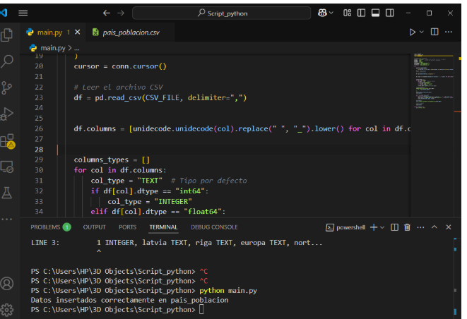
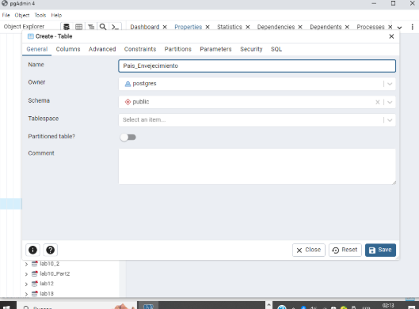
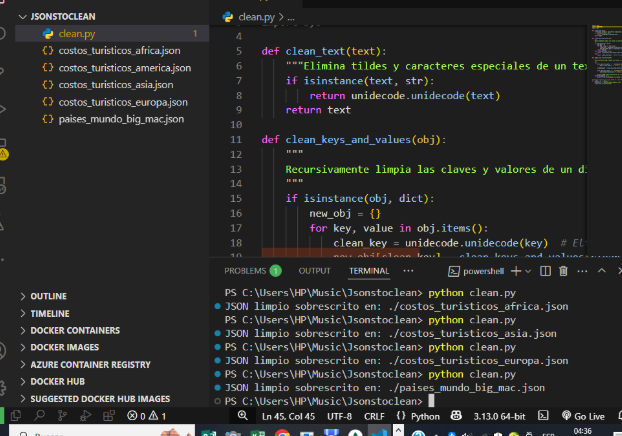
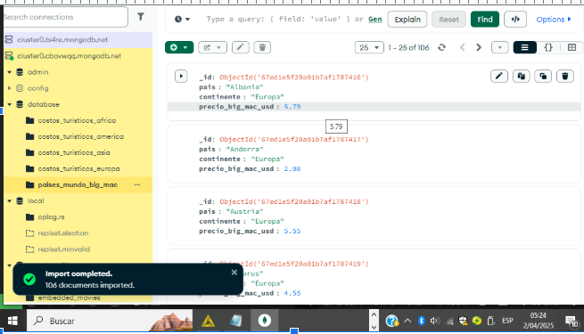
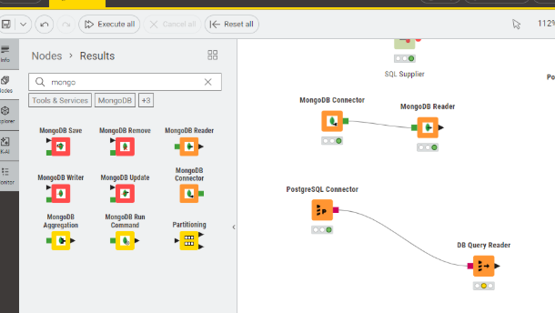
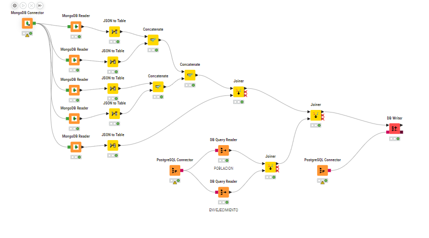
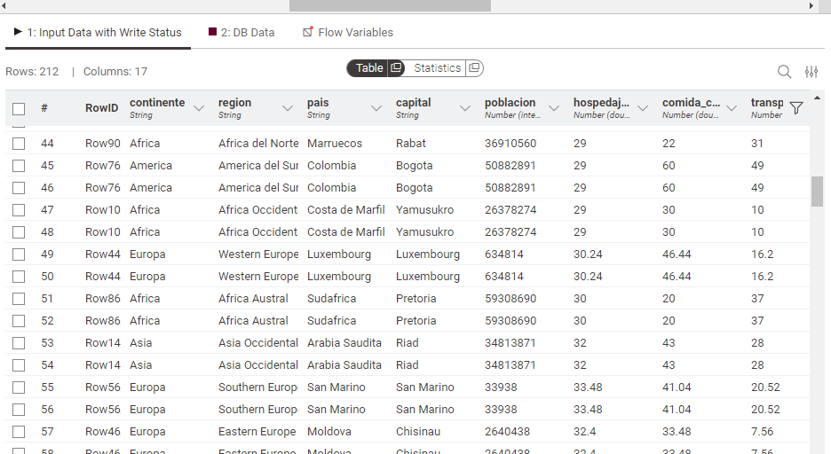
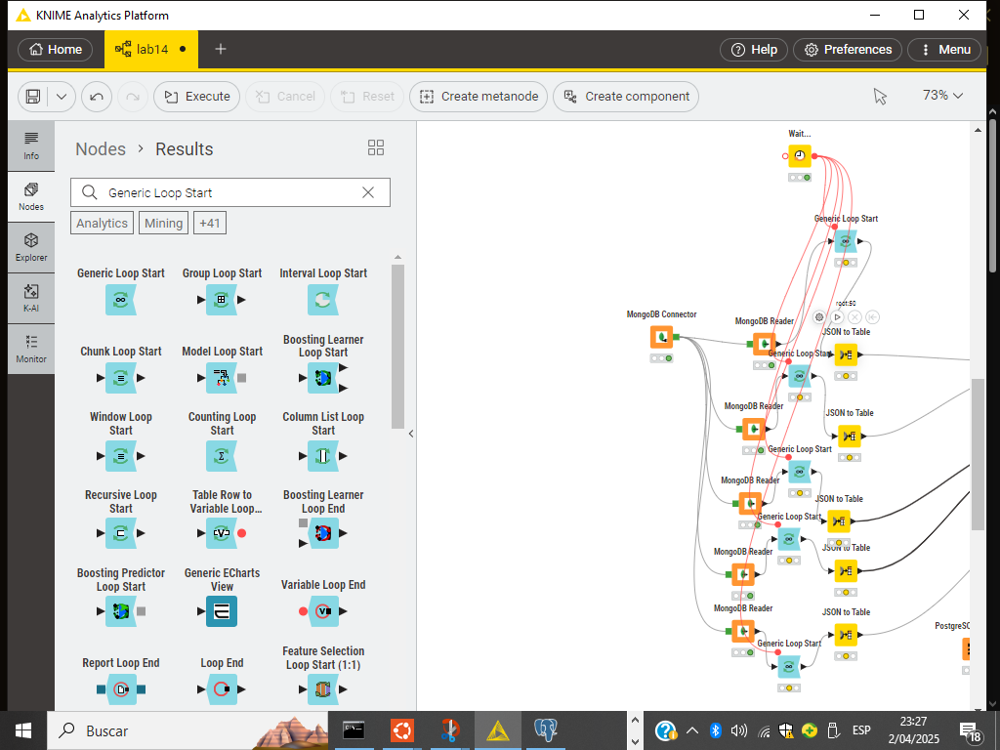
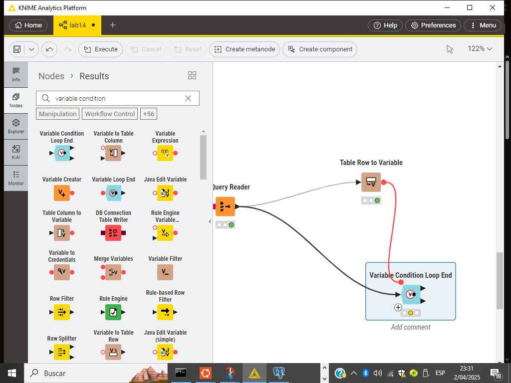

# ETL - Integración de Datos Relacionales y NoSQL con KNIME

Usamos

- Postgres (SQL)
- Knime (Gestor de conexiones)
- MongoCompasDB (NoSQL)
  
## 2.1 Ingeste los datos que se encuentran en la base de datos relacional. Revise si es necesario realizar algún tipo de limpieza sobre los datos

### Limpieza

Para ello si se realizo limpieza con los scripts en la carpeta

```bash
lab7/
│
├── DatosSQL/                  # CSVs de población y envejecimiento
├── DatosNoSQL/                # JSONs con datos turísticos y Big Mac
├── Parte1/                    # Código ETL e imágenes de resultados
│   ├── sql_clenaer.py              # Script de limpieza NOSQL
│  
```

Se ejecuta con python y debe de cambiarse las propiedades

- Cambio de variables

```python
DB_HOST = "localhost"  # Cambia si el servidor no está en tu máquina
DB_PORT = "5432"       # Puerto por defecto de PostgreSQL
DB_NAME = "nombre_db"
DB_USER = "usuario_db"
DB_PASSWORD = "contraseña"
TABLE_NAME = "nombre_tabla"
CSV_FILE = "./path_del_csv"
```

- Ejecucion

```bash
python sql_clenaer.py
```

Se limpian los csv y se ingresan de una vez a postgres tambien



### Carga de Datos

- Luego se ingreso en DDL de PgAdmin


## 2.2 Ingeste los datos que se encuentran en la base de datos no relacional. Revise si es necesario realizar algún tipo de limpieza sobre los datos

### Limpieza de datos

Esta en

```bash
lab7/
│
├── DatosSQL/                  # CSVs de población y envejecimiento
├── DatosNoSQL/                # JSONs con datos turísticos y Big Mac
├── Parte1/                    # Código ETL e imágenes de resultados
│   ├── json_cleaner.py              # Script de limpieza NOSQL
│  


- Cambio de variables
```python
json_path = "./json_path"
```

- Ejecucion

```bash
python json_cleaner.py
```



### Carga de Datos



## 2.3 Integre ambas fuentes de datos por medio de la herramienta de procesos de ETL

- Para esto se uso Knime, con un conector de Postgres y MongoDB



- Este fue el diagrama hecho, en knime juntando los json en una sola db y haciendo uso de json to table
- Luego se hizo un concatenate y un join con las otras base de datos SQL



- Aqui la salida de la db completamente limpia y junta


## 2.4 Configure la herramienta para que el proceso de ETL se ejecute cada cierto tiempo (la frecuencia de ejecución queda a su criterio)

- Para esto configuramos un looop para un wait se ejecute cada cierto tiempo en KNIME


## 2.4 Los datos integrados se deberán cargar en la base de datos que hace las veces de data warehouse, sin que se necesite su intervención

Esto se valida y se termina el loop cuando variable condition osea los row de los insertdos son mayores a 0.

