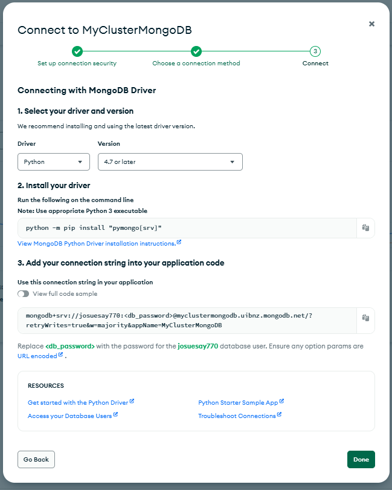

# ETL - Integración de Datos Relacionales y NoSQL

Este proyecto corresponde a la Parte 2 del laboratorio 7 de Bases de Datos 2.

## 📌 Requisitos

- Python 3.9+
- PostgreSQL
- Cuenta en [MongoDB Atlas](https://cloud.mongodb.com)

## 📁 Estructura de carpetas

```bash
lab7/
│
├── DatosSQL/                  # CSVs de población y envejecimiento
├── DatosNoSQL/                # JSONs con datos turísticos y Big Mac
├── Parte2/                    # Código ETL e imágenes de resultados
│   ├── parte2.py              # Script principal ETL
│   ├── requirements.txt       # Dependencias necesarias
│   ├── .env                   # Variables de conexión (ver abajo)
│   └── images/                # Imágenes de resultados

```

## 🔧 Configuración del entorno

### 1. Instalar dependencias

Desde la carpeta `Parte2`:

```bash
pip install -r requirements.txt
```

### 2. Crear archivo `.env` con las siguientes variables

```bash
# MongoDB
MONGODB_URI=mongodb+srv://<usuario>:<contraseña>@<cluster>.mongodb.net/?retryWrites=true&w=majority&appName=<ClusterName>
MONGODB_DBNAME=ClusterLab1

# PostgreSQL DW
PG_DW_HOST=localhost
PG_DW_DATABASE=Lab07_DW
PG_DW_USER=postgres
PG_DW_PASSWORD=tu_contraseña
PG_DW_PORT=5432
```

### 3. Obtener el URI de conexión MongoDB

1. Ingresa a tu [MongoDB Atlas Cluster](https://cloud.mongodb.com)
2. Da clic en **"Connect"** → **"Connect your application"**
3. Selecciona **Python** y copia el URI:

```bash
mongodb+srv://tu_usuario:<db_password>@<cluster>.mongodb.net/?retryWrites=true&w=majority
```

Reemplaza `<db_password>` con tu contraseña real.



### 4. Cargar los datos a MongoDB

Desde MongoDB Atlas, crea la base de datos y colecciones:

**Base de datos:**

```bash
ClusterLab1
```

**Colecciones:**

```bash
costos_turisticos_africa
costos_turisticos_america
costos_turisticos_asia
costos_turisticos_europa
paises_mundo_big_mac
```

Luego importa los archivos JSON desde `labs/lab7/DatosNoSQL`.

### 5. Crear la base de datos en PostgreSQL

Crea la base de datos `Lab07_DW` en PostgreSQL.

Asegúrate que el usuario (ej. `postgres`) tenga permisos para crear tablas.

## 🚀 Ejecución

Desde la carpeta `Parte2`, ejecuta:

```bash
python parte2.py
```

Esto hará:

1. Extracción de datos relacionales (`DatosSQL`)
2. Extracción de datos desde MongoDB Atlas (`DatosNoSQL`)
3. Integración de los datos en memoria
4. Carga al **Data Warehouse PostgreSQL**
5. Generación del archivo `datos_integrados_validados.csv`

**Resultado esperado:**


