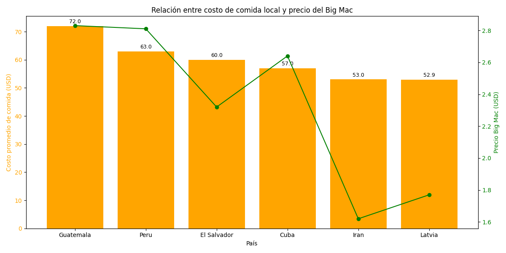

# Insights

## Insight 1: Países con alta tasa de envejecimiento no necesariamente tienen altos costos turísticos

- **Evidencia encontrada:**  
  Al analizar los 10 países con mayor **tasa de envejecimiento**, se observa que el **costo promedio de hospedaje y comida** varía significativamente. Por ejemplo:
  - Namibia (24.39% de envejecimiento) tiene un **costo promedio muy bajo** (USD 18.50).
  - Montenegro (24.31%) tiene un **costo alto** (USD 54.54).
  - Honduras (23.15%) muestra un **costo más alto** que EE. UU. con menor tasa.

  

- **Relevancia:**  
  Este hallazgo **rompe la suposición** de que los países más envejecidos tienen mayor costo de vida o turismo. Esto es clave para estrategias de turismo inclusivo y accesible, especialmente si se piensa en atraer adultos mayores a destinos con infraestructura adecuada pero menor costo.

- **Recomendación:**  
  Se recomienda **segmentar campañas turísticas dirigidas a adultos mayores** hacia países como **Namibia o Venezuela**, que combinan alta tasa de envejecimiento y costos bajos. Esto puede ser atractivo para turistas que buscan destinos tranquilos, accesibles y adecuados a sus necesidades.

## Insight 2: Alta disparidad entre el costo de comida local y el precio del Big Mac

- **Evidencia encontrada:**  
  Se identificaron países donde el costo promedio de la comida local supera los **USD 50 diarios**, pero el **precio del Big Mac está por debajo de los USD 3**, como por ejemplo:
  - **Guatemala:** comida local ≈ 72 USD / Big Mac: 2.83 USD
  - **Perú:** 63 USD / 2.81 USD
  - **El Salvador:** 60 USD / 2.32 USD
  - **Irán:** 53 USD / 1.62 USD

  La gráfica muestra una marcada diferencia entre las barras (costo local) y la línea (precio Big Mac), evidenciando la falta de correlación directa.

- **Relevancia:**  
  Esta disparidad puede deberse a varios factores:
  - Diferencias entre el **mercado formal y el informal**.
  - **Subsidios o regulación de precios** para marcas globales.
  - **Estrategias comerciales** de McDonald's u otras cadenas para mantener precios competitivos.

  Es una señal de que el Big Mac no siempre refleja fielmente el costo de vida local, lo cual es clave al usarlo como indicador económico.

  

- **Recomendación:**  
  Evitar utilizar el **Índice Big Mac** como única referencia para evaluar el costo de vida entre países. Aunque es una herramienta popular por su simplicidad, los resultados muestran que **el precio del Big Mac puede no reflejar fielmente la realidad económica local**, especialmente en países con:

  - **Distorsiones de mercado**, como subsidios o regulaciones específicas.
  - **Estrategias comerciales globales** que mantienen precios homogéneos a pesar del contexto económico.
  - **Altos niveles de informalidad**, donde los costos de productos locales no se alinean con los de cadenas internacionales.

  Esto limita su precisión y puede llevar a interpretaciones erróneas en análisis financieros, decisiones de inversión o estudios comparativos de poder adquisitivo.

## Insight 3: Países con bajo envejecimiento poblacional y bajo costo de entretenimiento

- **Evidencia encontrada:**  
  Al analizar los países con **tasa de envejecimiento menor al 10%** y **costos de entretenimiento menores a USD 25**, encontramos destinos como:
  - **Grecia** (8.92% envejecimiento / USD 10.80 entretenimiento)
  - **Hungría y Eslovaquia** (≈8.1% / USD 19.44)
  - **Paraguay** (5.51% / USD 21.00)

  La gráfica muestra cómo estos países combinan dos factores relevantes: una **población mayoritariamente joven** y **actividades recreativas accesibles**.

  

- **Relevancia:**  
  Este grupo de países representa destinos potencialmente atractivos para:
  - Jóvenes turistas o nómadas digitales que buscan lugares con **ambiente dinámico y bajo costo de vida**.
  - Inversionistas o emprendedores del sector ocio/cultura que deseen ingresar a mercados **menos saturados** pero con buena relación entre infraestructura y costos.

- **Recomendación:**  
  Se recomienda enfocar **estrategias turísticas, culturales o tecnológicas** hacia estos países, aprovechando la combinación de:
  - Población joven (mayor adopción tecnológica y demanda de entretenimiento)
  - Costos accesibles (mejora de margen para productos/servicios)
