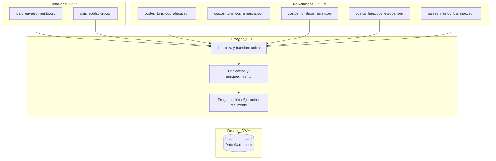

# Guia para Inciso 1 y 2

## Esquema general para integración de datos (ETL)

## Limpieza por archivo

| Archivo                              | Problemas detectados                                          | Limpieza necesaria                                                                 |
|-------------------------------------|---------------------------------------------------------------|-------------------------------------------------------------------------------------|
| `pais_envejecimiento.csv`           | Faltan columnas (Hungary, Angola, etc. vacíos)                | - Eliminar o imputar registros incompletos - Uniformar nombres de países        |
| `pais_población.csv`                | Algunos nombres no coinciden con otros archivos               | - Homogeneizar nombres de países (ej. Sudáfrica vs. South Africa)                  |
| `costos_turisticos_*.json`          | Estructura anidada, nombres de campos con espacios            | - Flatten del JSON - Renombrar campos (ej. `precio_promedio_usd`)               |
| `paises_mundo_big_mac.json`         | Faltan países presentes en otros datasets                     | - Validar existencia cruzada - Rellenar o marcar nulos donde no haya coincidencia |

## Posibles claves de integración

| Dataset                            | Clave sugerida para unión         |
|-----------------------------------|-----------------------------------|
| Todos los archivos                | `país` o `nombre_pais`            |
| Envejecimiento y población        | `nombre_pais` + `continente`      |
| Archivos JSON de costos turísticos| `país` + `continente`             |
| Big Mac                           | `país`                            |
