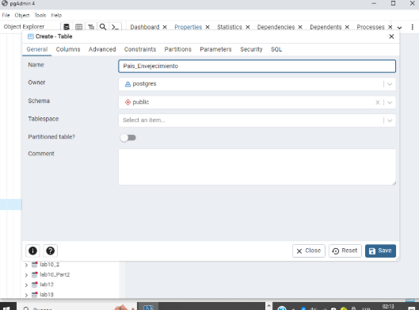
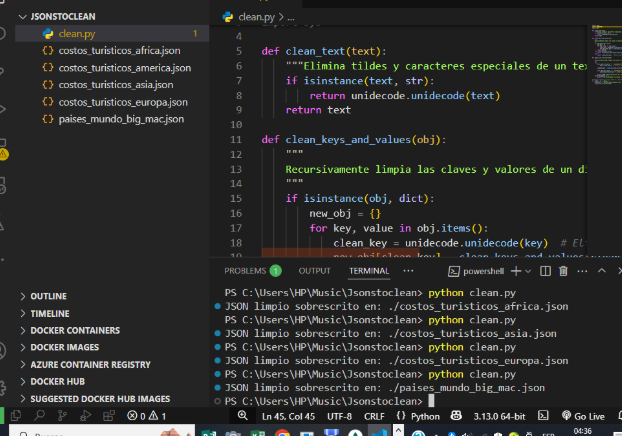
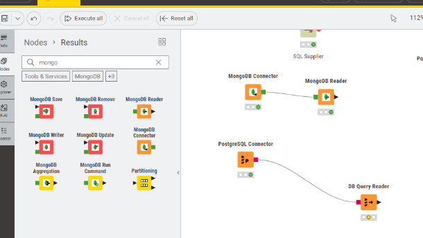
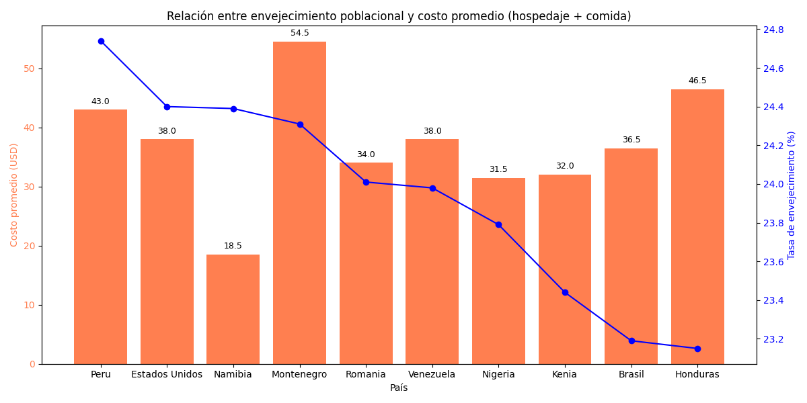
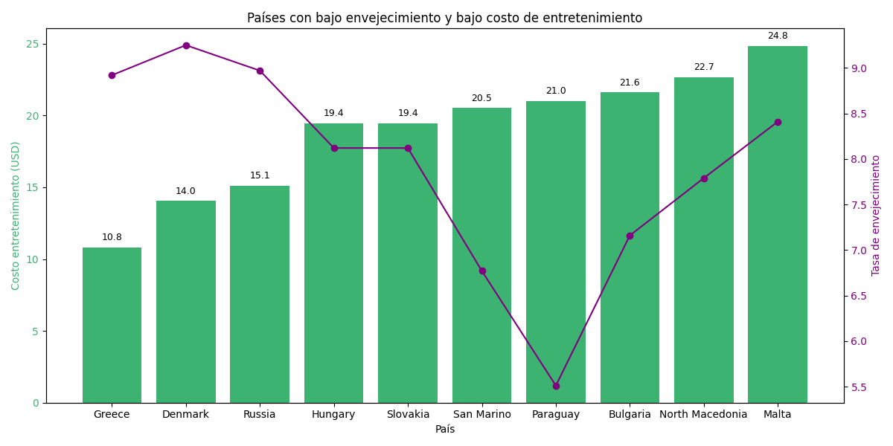

# Laboratorio 7: Integración de Datos y Extracción de Insights

## Integrantes

- Abby Donis - 22440
- Mathew Cordero - 22982
- Josué Say - 220801

## Ejercicio 1 - Integración de datos con una herramienta para procesos de ETL

Usamos `Postgres (SQL)`, `Knime (Gestor de conexiones)` y `MongoCompasDB (NoSQL)` para esta parte del ejercicio y la información de como ejecutar el programa se puede ver en el siguiente enlace del **[repositorio](https://github.com/donmatthiuz/BasedeDato2/tree/lab7/labs/lab7/Parte1)**.

### 1.1 Ingeste los datos que se encuentran en la base de datos relacional. Revise si es necesario realizar algún tipo de limpieza sobre los datos

#### Limpieza

Para ello si se realizo limpieza con los scripts en la carpeta

```bash
lab7/
│
├── DatosSQL/                  # CSVs de población y envejecimiento
├── DatosNoSQL/                # JSONs con datos turísticos y Big Mac
├── Parte1/                    # Código ETL e imágenes de resultados
│   ├── sql_clenaer.py              # Script de limpieza NOSQL
│  
```

Se ejecuta con python y debe de cambiarse las propiedades

- Cambio de variables

```python
DB_HOST = "localhost"  # Cambia si el servidor no está en tu máquina
DB_PORT = "5432"       # Puerto por defecto de PostgreSQL
DB_NAME = "nombre_db"
DB_USER = "usuario_db"
DB_PASSWORD = "contraseña"
TABLE_NAME = "nombre_tabla"
CSV_FILE = "./path_del_csv"
```

- Ejecucion

```bash
python sql_clenaer.py
```

- Se limpian los csv y se ingresan de una vez a postgres tambien

  

- Luego se ingreso en DDL de PgAdmin

  

### 1.2 Ingeste los datos que se encuentran en la base de datos no relacional. Revise si es necesario realizar algún tipo de limpieza sobre los datos

#### Limpieza de datos

Esta en

```bash
lab7/
│
├── DatosSQL/                  # CSVs de población y envejecimiento
├── DatosNoSQL/                # JSONs con datos turísticos y Big Mac
├── Parte1/                    # Código ETL e imágenes de resultados
│   ├── json_cleaner.py              # Script de limpieza NOSQL
│  
```

- Cambio de variables

  ```python
  json_path = "./json_path"
  ```

- Ejecucion

  ```bash
  python json_cleaner.py
  ```




### 1.3 Integre ambas fuentes de datos por medio de la herramienta de procesos de ETL

- Para esto se uso Knime, con un conector de Postgres y MongoDB

  

- Este fue el diagrama hecho, en knime juntando los json en una sola db y haciendo uso de json to table
- Luego se hizo un concatenate y un join con las otras base de datos SQL

  

- Aqui la salida de la db completamente limpia y junta

  

### 1.4 Configure la herramienta para que el proceso de ETL se ejecute cada cierto tiempo (la frecuencia de ejecución queda a su criterio)

- Para esto configuramos un loop para un wait se ejecute cada cierto tiempo en KNIME


### 1.4 Los datos integrados se deberán cargar en la base de datos que hace las veces de data warehouse, sin que se necesite su intervención

Esto se valida y se termina el loop cuando variable condition osea los row de los insertdos son mayores a 0.


## Ejercicio 2 - Integración de datos con un lenguaje de programación

Se usó python para esta parte del ejercicio y la información de como ejecutar el programa se puede ver en el siguiente enlace del **[repositorio](https://github.com/donmatthiuz/BasedeDato2/tree/lab7/labs/lab7/Parte2)**. Dicho ejercicio obtiene este resultado:


También la data csv retornada por el código adjuntada en la entrega o al ejecutar el código de esta parte del ejercicio.

## Ejercicio 3 - Insights sobre los datos

Una vez integrada la información proveniente de la base relacional y no relacional, se deben extraer conocimientos útiles que impulsen la acción. La información de como ejecutar el programa se puede ver en el siguiente enlace del **[repositorio](https://github.com/donmatthiuz/BasedeDato2/tree/lab7/labs/lab7/Parte3)**

### Insight 1: Países con alta tasa de envejecimiento no necesariamente tienen altos costos turísticos

- **Evidencia encontrada:**  
  Al analizar los 10 países con mayor **tasa de envejecimiento**, se observa que el **costo promedio de hospedaje y comida** varía significativamente. Por ejemplo:
  - Namibia (24.39% de envejecimiento) tiene un **costo promedio muy bajo** (USD 18.50).
  - Montenegro (24.31%) tiene un **costo alto** (USD 54.54).
  - Honduras (23.15%) muestra un **costo más alto** que EE. UU. con menor tasa.

  

- **Relevancia:**  
  Este hallazgo **rompe la suposición** de que los países más envejecidos tienen mayor costo de vida o turismo. Esto es clave para estrategias de turismo inclusivo y accesible, especialmente si se piensa en atraer adultos mayores a destinos con infraestructura adecuada pero menor costo.

- **Recomendación:**  
  Se recomienda **segmentar campañas turísticas dirigidas a adultos mayores** hacia países como **Namibia o Venezuela**, que combinan alta tasa de envejecimiento y costos bajos. Esto puede ser atractivo para turistas que buscan destinos tranquilos, accesibles y adecuados a sus necesidades.

### Insight 2: Alta disparidad entre el costo de comida local y el precio del Big Mac

- **Evidencia encontrada:**  
  Se identificaron países donde el costo promedio de la comida local supera los **USD 50 diarios**, pero el **precio del Big Mac está por debajo de los USD 3**, como por ejemplo:
  - **Guatemala:** comida local ≈ 72 USD / Big Mac: 2.83 USD
  - **Perú:** 63 USD / 2.81 USD
  - **El Salvador:** 60 USD / 2.32 USD
  - **Irán:** 53 USD / 1.62 USD

  La gráfica muestra una marcada diferencia entre las barras (costo local) y la línea (precio Big Mac), evidenciando la falta de correlación directa.

- **Relevancia:**  
  Esta disparidad puede deberse a varios factores:
  - Diferencias entre el **mercado formal y el informal**.
  - **Subsidios o regulación de precios** para marcas globales.
  - **Estrategias comerciales** de McDonald's u otras cadenas para mantener precios competitivos.

  Es una señal de que el Big Mac no siempre refleja fielmente el costo de vida local, lo cual es clave al usarlo como indicador económico.

  

- **Recomendación:**  
  Evitar utilizar el **Índice Big Mac** como única referencia para evaluar el costo de vida entre países. Aunque es una herramienta popular por su simplicidad, los resultados muestran que **el precio del Big Mac puede no reflejar fielmente la realidad económica local**, especialmente en países con:

  - **Distorsiones de mercado**, como subsidios o regulaciones específicas.
  - **Estrategias comerciales globales** que mantienen precios homogéneos a pesar del contexto económico.
  - **Altos niveles de informalidad**, donde los costos de productos locales no se alinean con los de cadenas internacionales.

  Esto limita su precisión y puede llevar a interpretaciones erróneas en análisis financieros, decisiones de inversión o estudios comparativos de poder adquisitivo.

### Insight 3: Países con bajo envejecimiento poblacional y bajo costo de entretenimiento

- **Evidencia encontrada:**  
  Al analizar los países con **tasa de envejecimiento menor al 10%** y **costos de entretenimiento menores a USD 25**, encontramos destinos como:
  - **Grecia** (8.92% envejecimiento / USD 10.80 entretenimiento)
  - **Hungría y Eslovaquia** (≈8.1% / USD 19.44)
  - **Paraguay** (5.51% / USD 21.00)

  La gráfica muestra cómo estos países combinan dos factores relevantes: una **población mayoritariamente joven** y **actividades recreativas accesibles**.

  

- **Relevancia:**  
  Este grupo de países representa destinos potencialmente atractivos para:
  - Jóvenes turistas que buscan lugares con **ambiente dinámico y bajo costo de vida**.
  - Inversionistas o emprendedores del sector ocio/cultura que deseen ingresar a mercados **menos saturados** pero con buena relación entre infraestructura y costos.

- **Recomendación:**  
  Se recomienda enfocar **estrategias turísticas, culturales o tecnológicas** hacia estos países, aprovechando la combinación de:
  - Población joven (mayor adopción tecnológica y demanda de entretenimiento)
  - Costos accesibles (mejora de margen para productos/servicios)
