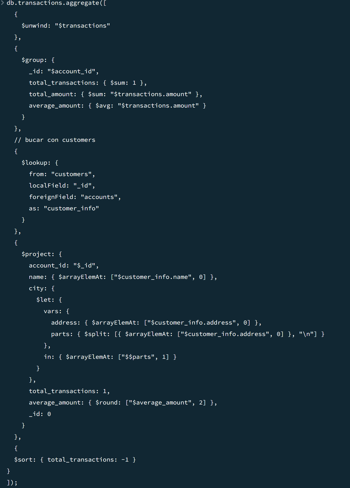
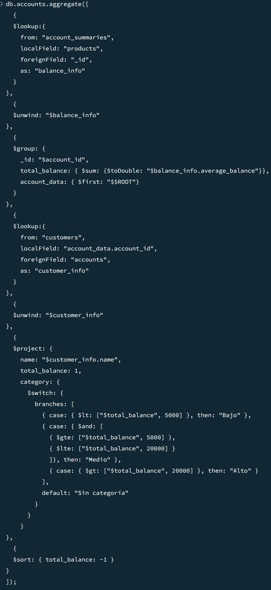
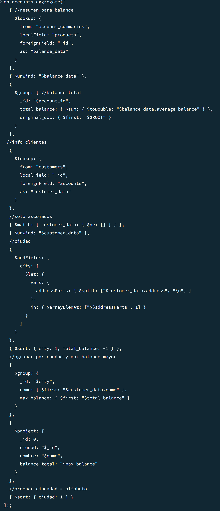
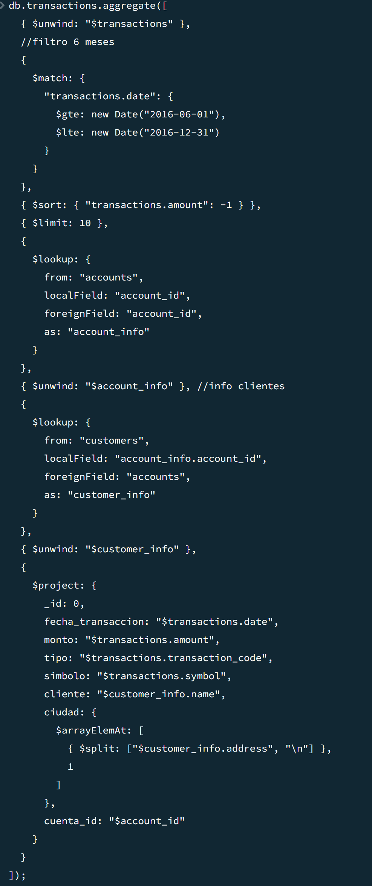

# Laboratorio 8 Agregation Pepilines

### 2.1 Para cada cliente, calcule el número total de transacciones y el monto promedio de cada una. Muestre el nombre completo, ciudad y los resultados ordenados por número de transacciones descendente 

### 2.2 Clasifique a los clientes en tres categorías según su balance total, debe mostrar el nombre y categoría de estos
- Bajo (<5,000) 
- Medio (5,000 - 20,000) 
- Alto (>20,000) 

### 2.3 Para cada ciudad, identifique el cliente con el mayor balance total sumando todas sus cuentas. Muestre únicamente el nombre, ciudad y total

### 2.4 Extraiga las 10 transacciones más altas realizadas en los últimos 6 meses y enriquezca el resultado con información del cliente asociado

