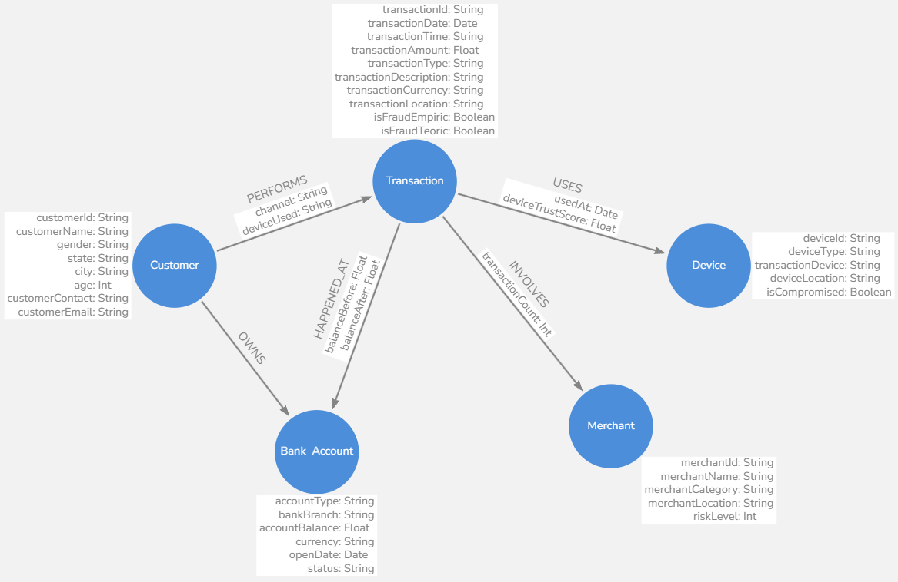

# Bank Transaction Fraud Detection  

## Enlaces  

- [Descripción del dataset](https://www.dynamicduniya.in/dataset/bank-transaction-fraud-detection)  
- [Descargar dataset](https://www.kaggle.com/datasets/marusagar/bank-transaction-fraud-detection)

## Estructura de los Datos (CSV)

| **Índice** | **Variable**        | **Significado**                                                     | **Tipo de Dato**  |
|--------|-------------------------|---------------------------------------------------------------------|-------------------|
| 1      | Customer_ID             | Identificador del cliente en el sistema de banco.                   | String            |
| 2      | Customer_Name           | Nombre del cliente.                                                 | String            |
| 3      | Gender                  | Género del cliente.                                                 | String            |
| 4      | Age                     | Edad del cliente.                                                   | Int               |
| 5      | State                   | Estado donde reside el cliente.                                     | String            |
| 6      | City                    | Ciudad donde vive el cliente.                                       | String            |
| 7      | Bank_Branch             | Sucursal bancaria donde el cliente tiene su cuenta.                 | String            |
| 8      | Account_Type            | Tipo de cuenta (por ejemplo ahorro) del cliente.                    | String            |
| 9      | Transaction_ID          | Identificador para la transacción.                                  | String            |
| 10     | Transaction_Date        | Fecha de la transacción.                                            | String            |
| 11     | Transaction_Time        | Hora de la transacción.                                             | String            |
| 12     | Transaction_Amount      | Monto de la transacción.                                            | Float             |
| 13     | Merchant_ID             | Comerciante/establecimiento donde se realiza la transacción.        | String            |
| 14     | Transaction_Type        | Tipo de transacción.                                                | String            |
| 15     | Merchant_Category       | Tipo de negocio del comerciante/establecimiento.                    | String            |
| 16     | Account_Balance         | Saldo en la cuenta del cliente después de la transacción.           | Float             |
| 17     | Transaction_Device      | Tipo de plataforma o entorno desde donde se realizó la transacción. | String            |
| 18     | Transaction_Location    | Ubicación geográfica de donde se hizo la transacción.               | String            |
| 19     | Device_Type             | Tipo de dispositivo físico usado en la transacción.                 | String            |
| 20     | Is_Fraud                | Indicador (0-1) representa si la transacción es fraude o no.        | Int               |
| 21     | Transaction_Currency    | Tipo de moneda utilizada en la transacción.                         | String            |
| 22     | Customer_Contact        | Número de teléfono del cliente.                                     | String            |
| 23     | Transaction_Description | Descripción breve del tipo de transacción (motivo).                 | String            |
| 24     | Customer_Email          | Correo electrónico del cliente.                                     | String            |

## Diseño del Modelo de Datos

### Estructura de Nodos

| **Nodo**       | **Atributos (Variables)**                                       | **Tipo de Dato**  |
|----------------|-----------------------------------------------------------------|-------------------|
| **Customer**   | Customer_ID (Identificador del cliente)                         | String            |
|                | Customer_Name (Nombre del cliente)                              | String            |
|                | Gender (Género del cliente)                                     | String            |
|                | Age (Edad del cliente)                                          | Int               |
|                | State (Estado donde reside el cliente)                          | String            |
|                | City (Ciudad donde vive el cliente)                             | String            |
|                | Customer_Contact (Número de teléfono del cliente)               | String            |
|                | Customer_Email (Correo electrónico del cliente)                 | String            |
| **Bank_Account** | Account_Type (Tipo de cuenta bancaria)                        | String            |
|                | Bank_Branch (Sucursal bancaria)                                 | String            |
|                | Account_Balance (Saldo de la cuenta)                            | Float             |
|                | Currency* (Moneda de la cuenta)                                 | String            |
|                | Open_Date* (Fecha de apertura de la cuenta)                     | Date              |
|                | Status* (Estado de la cuenta: Activa, Congelada, etc.)          | String            |
| **Transaction** | Transaction_ID (Identificador de la transacción)               | String            |
|                | Transaction_Date (Fecha de la transacción)                      | Date              |
|                | Transaction_Time (Hora de la transacción)                       | String            |
|                | Transaction_Amount (Monto de la transacción)                    | Float             |
|                | Transaction_Type (Tipo de transacción)                          | String            |
|                | Transaction_Description (Descripción de la transacción)         | String            |
|                | Transaction_Currency (Moneda usada en la transacción)           | String            |
|                | Transaction_Location (Ubicación de la transacción)              | String            |
|                | Is_Fraud_Empiric* (Indica si la transacción es fraudulenta)     | Boolean           |
|                | Is_Fraud_Teoric (Indica si la transacción es fraudulenta)       | Boolean           |
| **Merchant**   | Merchant_ID (Identificador del comerciante)                     | String            |
|                | Merchant_Name* (Nombre del comerciante)                         | String            |
|                | Merchant_Category (Categoría del comerciante)                   | String            |
|                | Merchant_Location* (Ubicación del comerciante)                  | String            |
|                | Risk_Level* (Nivel de riesgo del comerciante)                   | Int               |
| **Device**     | Device_ID* (Identificador del dispositivo)                      | String            |
|                | Device_Type (Tipo de dispositivo usado)                         | String            |
|                | Transaction_Device (Plataforma usada en la transacción)         | String            |
|                | Device_Location* (Ubicación del dispositivo)                    | String            |
|                | Is_Compromised* (Indica si el dispositivo ha sido comprometido) | Boolean           |

### Relaciones

| **Relación**                    | **Inicio → Fin**                   | **Propiedades**                                                                             |
|---------------------------------|------------------------------------|---------------------------------------------------------------------------------------------|
| `OWNS`                          | `(:Customer) → (:Bank_Account)`    | `since*` (Date), `account_status*` (String)                                                 |
| `PERFORMS`                      | `(:Customer) → (:Transaction)`     | `channel` (String), `device_used` (String), `location_mismatch` (Boolean)                   |
| `USES`                          | `(:Transaction) → (:Device)`       | `used_at` (Date), `device_trust_score` (Float)                                              |
| `INVOLVES`                      | `(:Transaction) → (:Merchant)`     | `transaction_count` (Int)                                                               |
| `HAPPENED_AT`                   | `(:Transaction) → (:Bank_Account)` | `balance_before` (Float), `balance_after` (Float)                                           |

Haciendo un análisis para obtener `device_trust_score` basandonos en 4 puntos

1. **Autenticación**: Uso de PIN, biometría, token de seguridad, etc.
2. **Vulnerabilidad a Fraudes**: Riesgo de skimming, malware, phishing, etc.
3. **Conectividad**: Uso de redes seguras vs. redes abiertas o comprometidas.
4. **Control del Usuario**: Si el usuario tiene control sobre el acceso al dispositivo.
5. **Supervisión Bancaria**: Medidas antifraude y monitoreo de transacciones.

Dado esto, podemos hacer una estimación general:

| Método | Autenticación | Vulnerabilidad a Fraudes | Conectividad | Control del Usuario | Supervisión Bancaria | Puntaje Estimado |
|--------|--------------|-------------------------|--------------|---------------------|----------------------|------------------|
| **ATM** | Alta (PIN, chip) | Medio (skimming, clonación) | Alta (red bancaria segura) | Medio (físico, pero puede ser comprometido) | Alta (banco supervisa transacciones) | **0.85** |
| **POS** | Medio (PIN o firma) | Alto (skimming, terminales comprometidos) | Medio (red comercial) | Bajo (depende del comerciante) | Medio (banco revisa, pero menos control que ATM) | **0.65** |
| **Mobile** | Alta (biometría, 2FA) | Medio (malware, phishing) | Bajo (WiFi insegura, red móvil) | Alto (usuario controla acceso) | Alta (monitoreo bancario en apps) | **0.80** |
| **Desktop** | Medio (usuario/contraseña, 2FA) | Alto (phishing, malware) | Bajo (uso de redes abiertas, malware) | Medio (depende del usuario) | Alto (bancos aplican seguridad en banca web) | **0.70** |

- **ATM (0.85)** es el más confiable por su red segura y autenticación fuerte.
- **Mobile (0.80)** es seguro si se usan apps oficiales y autenticación biométrica.
- **Desktop (0.70)** es menos confiable debido a malware y phishing.
- **POS (0.65)** es el menos confiable por su exposición a fraudes en comercios.

#### **1. `OWNS` (Customer → Bank_Account)**

**Propósito:** Representa la relación de propiedad entre un cliente y su cuenta bancaria.  
**Propiedades:**

<!-- - `since*` (Date) → Fecha en la que se abrió la cuenta.
- `account_status*` (String) → Estado de la cuenta (Ejemplo: "Activa", "Cerrada", "Congelada"). -->

#### **2. `PERFORMS` (Customer → Transaction)**

**Propósito:** Representa que un cliente realizó una transacción.  
**Propiedades:**

- `channel` (String) → Medio por el cual se realizó la transacción (Ejemplo: "Cajero Automático", "Banca Móvil") (Transaction_Device).
- `device_used` (String) → Tipo de dispositivo usado (Ejemplo: "POS", "Navegador Web") (Device_Type).
<!-- - `location_mismatch` (Boolean) → Indica si la ubicación de la transacción es inusual para el cliente. -->

*Ejemplo:*  
Si un cliente suele realizar transacciones en un país pero de repente hace una compra en otro pais sin historial de viajes, esto podría indicar un fraude.

#### **3. `USES` (Transaction → Device)**

**Propósito:** Muestra qué dispositivo se utilizó para una transacción.  
**Propiedades:**

- `used_at` (Date) → Fecha y hora en la que se usó el dispositivo.
- `device_trust_score` (Float) → Puntaje de confianza del dispositivo (Ejemplo: 0.0 - 1.0, donde 0 es sospechoso y 1 es confiable).

*Ejemplo:*  
Si un cliente que siempre usa su teléfono móvil para transacciones de repente usa un dispositivo desconocido, esto puede ser sospechoso.

#### **4. `INVOLVES` (Transaction → Merchant)**

**Propósito:** Indica que una transacción ocurrió en un comercio específico.  
**Propiedades:**

- `transaction_count` (Int) → Número de transacciones realizadas en este comercio.

*Ejemplo:*  
Si un comercio tiene un alto `merchant_risk_score`, significa que ha estado involucrado en fraudes antes y las transacciones realizadas allí pueden ser riesgosas.

#### **5. `HAPPENED_AT` (Transaction → Bank_Account)**

**Propósito:** Representa en qué cuenta bancaria ocurrió la transacción.  
**Propiedades:**

- `balance_before` (Float) → Saldo de la cuenta antes de la transacción.
- `balance_after` (Float) → Saldo de la cuenta después de la transacción.

*Ejemplo:*  
Si una cuenta tiene múltiples transacciones en un corto período de tiempo con saldo insuficiente, esto puede indicar fraude.

### Diagrama de Modelo de Datos

> **Nota:** Se descartará la columna con el atributo `Is_Fraud` para hacer la exploración sin tener conocimientos del veredicto de la transacción y utilizar las herramientas propuestas para determinar si es o no una transacción fraudulenta.
