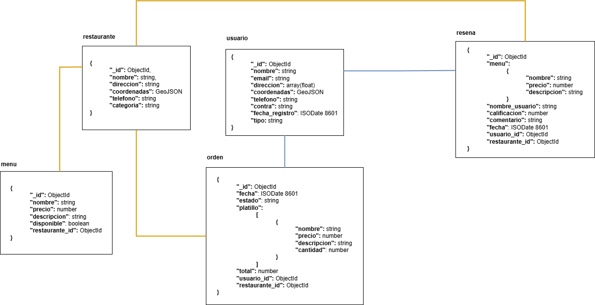

# Modelo



## Restaurante

Este modelo representa un restaurante registrado en la base de datos.

### Estructura del documento

| Campo         | Tipo       | Descripción                                                               |
| ------------- | ---------- | ------------------------------------------------------------------------- |
| `_id`         | `ObjectId` | Identificador único generado automáticamente por MongoDB                  |
| `nombre`      | `string`   | Nombre del restaurante                                                    |
| `direccion`   | `string`   | Dirección completa del restaurante                                        |
| `telefono`    | `string`   | Número de contacto en formato internacional (ej. +34, +502, etc.)         |
| `categoria`   | `string`   | Tipo de comida o categoría (ej. Parrillada, Mexicana, Italiana, etc.)     |
| `coordenadas` | `GeoJSON`  | Coordenadas geográficas en formato GeoJSON (`type: Point`, `coordinates`) |

**Nota:** El campo `coordenadas` debe tener el formato correcto de GeoJSON Point, con el orden `[longitud, latitud]`.

### Ejemplo de documento

```json
{
  "nombre": "La Carnicería",
  "direccion": "Plaza Olegario Dueñas 1 Apt. 84 \nLa Coruña, 04962",
  "telefono": "+34 928 766 724",
  "categoria": "Parrillada",
  "coordenadas": {
    "type": "Point",
    "coordinates": [-90.51234, 14.62345]
  }
}
```

### Índices

1. **Índice simple:**

   ```js
   db.restaurante.createIndex({ nombre: 1 })
   ```

   > Búsqueda rápida por nombre del restaurante.

2. **Índice de texto:**

   ```js
   db.restaurante.createIndex({ nombre: "text", categoria: "text" })
   ```

   > Para búsquedas de texto en nombre y categoría.

3. **Índice geoespacial:**

   ```js
   db.restaurante.createIndex({ coordenadas: "2dsphere" })
   ```

   > Para realizar búsquedas geográficas (por ubicación) usando coordenadas \[longitud, latitud].

## Artículo del Menú (`Menu`)

Este modelo representa un platillo o producto ofrecido en el menú de un restaurante.

### Estructura del documento

| Campo            | Tipo       | Descripción                                                             |
| ---------------- | ---------- | ----------------------------------------------------------------------- |
| `_id`            | `ObjectId` | Identificador único generado automáticamente por MongoDB                |
| `nombre`         | `string`   | Nombre del platillo o artículo del menú                                 |
| `precio`         | `number`   | Precio del artículo en la moneda local                                  |
| `descripcion`    | `string`   | Descripción opcional del platillo                                       |
| `disponible`     | `boolean`  | Indica si el artículo está disponible para pedidos (por defecto `true`) |
| `restaurante_id` | `ObjectId` | Referencia al `_id` del restaurante al que pertenece este artículo      |

### Ejemplo de documento

```json
{
  "nombre": "Hamburguesa BBQ",
  "descripcion": "Hamburguesa con salsa BBQ, queso cheddar y tocino",
  "precio": 58.9,
  "disponible": true,
  "restaurante_id": "681741a5a913f0b464ef950f"
}
```

**Nota:** El campo `restaurante_id`  debe existir en los documentos de `restaurante`.

### Índices

1. **Índice compuesto:**  

   ```js
   db.menu.createIndex({ restaurante_id: 1, disponible: 1 })
   ```

   > Para listar artículos disponibles por restaurante.

2. **Índice de texto:**  

   ```js
   db.menu.createIndex({ nombre: "text", descripcion: "text" })
   ```

   > Permite búsquedas por nombre y descripción del platillo.

## Usuario

Este modelo representa un usuario registrado en la plataforma.

### Estructura del documento

| Campo            | Tipo       | Descripción                                                               |
| ---------------- | ---------- | ------------------------------------------------------------------------- |
| `_id`            | `ObjectId` | Identificador único generado automáticamente por MongoDB                  |
| `nombre`         | `string`   | Nombre completo del usuario                                               |
| `email`          | `string`   | Dirección de correo electrónico única                                     |
| `direccion`      | `string`   | Dirección física del usuario                                              |
| `telefono`       | `string`   | Número de contacto en formato internacional (ej. +502 1234 5678)          |
| `contra`         | `string`   | Contraseña en formato encriptado u ofuscado                               |
| `fecha_registro` | `ISODate`  | Fecha y hora en que el usuario se registró                                |
| `tipo`           | `string`   | Rol o tipo de usuario (ej. cliente, repartidor, administrador, etc.)      |
| `coordenadas`    | `GeoJSON`  | Coordenadas geográficas en formato GeoJSON (`type: Point`, `coordinates`) |

**Nota:** El campo `coordenadas` debe tener el formato correcto de GeoJSON Point, con el orden `[longitud, latitud]`.

### Ejemplo de documento

```json
{
  "nombre": "Luisa Romero García",
  "email": "luisa.romero@example.com",
  "direccion": "Calle Principal 123\nMadrid, 28001",
  "telefono": "+34 911 223 334",
  "contra": "P@ssword2024",
  "fecha_registro": "2024-06-10T09:00:00Z",
  "tipo": "cliente",
  "coordenadas": {
    "type": "Point",
    "coordinates": [-90.50123, 14.62056]
  }
}
```

**Nota:** Dado que se utilizará `mongoimport` para insertar los datos, se debe declarar los valores utilizando el formato correcto de MongoDB Extended JSON con `"$date"`:

```js
"fecha_registro": {
   "$date": "2024-06-10T09:00:00Z"
}
```

De lo contrario, las fechas se almacenarán como simples strings y no podrán ser consultadas correctamente mediante filtros por rango de fechas (`$gte`, `$lte`, etc.).

### Índices

1. **Índice compuesto:**  

   ```js
   db.usuario.createIndex({ nombre: 1, tipo: 1 })
   ```

   > Mejora búsquedas por nombre y tipo de usuario (ej. administrador, cliente).

2. **Índice geoespacial:**

   ```js
   db.usuario.createIndex({ coordenadas: "2dsphere" })
   ```

   > Para realizar búsquedas geográficas (por ubicación) usando coordenadas \[longitud, latitud].

## Orden

Este modelo representa una orden realizada por un usuario hacia un restaurante determinado.

### Estructura del documento

| Campo                     | Tipo       | Descripción                                                                  |
| ------------------------- | ---------- | ---------------------------------------------------------------------------- |
| `_id`                     | `ObjectId` | Identificador único generado automáticamente por MongoDB                     |
| `fecha`                   | `ISODate`  | Fecha en que se realizó la orden. Se asigna automáticamente si no se incluye |
| `estado`                  | `string`   | Estado de la orden (ej. pendiente, completada, cancelada)                    |
| `platillos`               | `array`    | Lista de platillos solicitados en la orden                                   |
| `platillos[].nombre`      | `string`   | Nombre del platillo tal como fue pedido                                      |
| `platillos[].descripcion` | `string`   | Descripción del platillo                                                     |
| `platillos[].precio`      | `number`   | Precio unitario del platillo                                                 |
| `platillos[].cantidad`    | `number`   | Cantidad de unidades solicitadas                                             |
| `total`                   | `number`   | Total monetario calculado de la orden                                        |
| `usuario_id`              | `ObjectId` | Referencia al `_id` del usuario que hizo la orden                            |
| `restaurante_id`          | `ObjectId` | Referencia al `_id` del restaurante al que pertenece la orden                |

### Ejemplo de documento

```json
{
  "usuario_id": "68174f099a2bb59ba7bb111c",
  "restaurante_id": "681741a5a913f0b464ef950f",
  "estado": "pendiente",
  "fecha": "2024-07-01T10:30:00Z",
  "platillos": [
    {
      "nombre": "Tacos de prueba A",
      "descripcion": "Tacos con ingredientes de prueba para el Restaurante A",
      "precio": 35,
      "cantidad": 2
    }
  ],
  "total": 70
}
```

**Nota:** Dado que se utilizará `mongoimport` para insertar los datos, se debe declarar los valores utilizando el formato correcto de MongoDB Extended JSON con `"$date"`:

De lo contrario, las fechas se almacenarán como simples strings y no podrán ser consultadas correctamente mediante filtros por rango de fechas (`$gte`, `$lte`, etc.).

```js
"fecha": {
   "$date": "2024-07-01T10:30:00Z"
}
```

**Nota:** Los campos `usuario_id` y `restaurante_id` debe existir en los documentos de `restaurante` y `usuario` respectivamente.

### Índices

1. **Índice compuesto:**

   ```js
   db.orden.createIndex({ usuario_id: 1, fecha: -1 })
   ```

   > Consultas por órdenes recientes de un usuario.

2. **Índice simple:**

   ```js
   db.orden.createIndex({ restaurante_id: 1 })
   ```

   > Filtrado de órdenes por restaurante.

## **resena**

**Atributos:**

* `_id`: ObjectId
* `menu`:
  * `nombre`: string
  * `precio`: number
  * `descripcion`: string
* `nombre_usuario`: string
* `calificacion`: number
* `comentario`: string
* `fecha`: ISODate
* `usuario_id`: ObjectId
* `restaurante_id`: ObjectId

**Índices:**

1. **Índice compuesto:**

   ```js
   db.resena.createIndex({ restaurante_id: 1, calificacion: -1 })
   ```

   > Consultas por calificaciones de un restaurante.

2. **Índice simple:**

   ```js
   db.resena.createIndex({ usuario_id: 1 })
   ```

   > Para ver reseñas hechas por un usuario.

3. **Índice simple:**

   ```js
   db.resena.createIndex({ nombre_usuario: 1 })
   ```

   > Para buscar reseñas por nombre de usuario.
