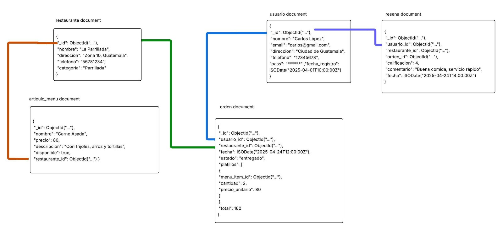

# Modelo



## **restaurante**

**Atributos:**

- `_id`: ObjectId
- `nombre`: string
- `direccion`: string
- `telefono`: string
- `categoria`: string

**Índices:**

1. **Índice simple:**  

   ```js
   db.restaurante.createIndex({ nombre: 1 })
   ```

   > Búsqueda rápida por nombre del restaurante.

2. **Índice de texto:**  

   ```js
   db.restaurante.createIndex({ nombre: "text", categoria: "text" })
   ```

   > Para búsquedas de texto en nombre y categoría.

## **articulo_menu**

**Atributos:**

- `_id`: ObjectId
- `nombre`: string
- `precio`: number
- `descripcion`: string
- `disponible`: boolean
- `restaurante_id`: ObjectId (referencia a restaurante)

**Índices:**

1. **Índice compuesto:**  

   ```js
   db.menu.createIndex({ restaurante_id: 1, disponible: 1 })
   ```

   > Para listar artículos disponibles por restaurante.

2. **Índice de texto:**  

   ```js
   db.menu.createIndex({ nombre: "text", descripcion: "text" })
   ```

   > Permite búsquedas por nombre y descripción del platillo.

## **usuario**

**Atributos:**

- `_id`: ObjectId
- `nombre`: string
- `email`: string
- `direccion`: string
- `telefono`: string
- `contra`: string
- `fecha_registro`: ISODate

**Índices:**

1. **Índice compuesto:**  

   ```js
   db.usuario.createIndex({ nombre: 1, direccion: 1 })
   ```

   > Mejora búsquedas por nombre y ubicación.

## **orden**

**Atributos:**

- `_id`: ObjectId
- `usuario_id`: ObjectId (referencia a usuario)
- `restaurante_id`: ObjectId (referencia a restaurante)
- `fecha`: ISODate
- `estado`: string
- `platillos`: array de objetos con:
  - `menu_item_id`: ObjectId (referencia a articulo_menu)
  - `cantidad`: number
  - `precio_unitario`: number
- `total`: number

**Índices:**

1. **Índice compuesto:**  

   ```js
   db.orden.createIndex({ usuario_id: 1, fecha: -1 })
   ```

   > Consultas por órdenes recientes de un usuario.

2. **Índice multikey (por array):**  

   ```js
   db.orden.createIndex({ "platillos.menu_item_id": 1 })
   ```

   > Mejora consultas por items de menú en pedidos.

## **resena**

**Atributos:**

- `_id`: ObjectId
- `usuario_id`: ObjectId (referencia a usuario)
- `restaurante_id`: ObjectId (referencia a restaurante)
- `orden_id`: ObjectId (referencia a orden)
- `calificacion`: number
- `comentario`: string
- `fecha`: ISODate

**Índices:**

1. **Índice compuesto:**  

   ```js
   db.resena.createIndex({ restaurante_id: 1, calificacion: -1 })
   ```

   > Consultas por calificaciones de un restaurante.

2. **Índice simple:**  

   ```js
   db.resena.createIndex({ usuario_id: 1 })
   ```

   > Para ver reseñas hechas por un usuario.
