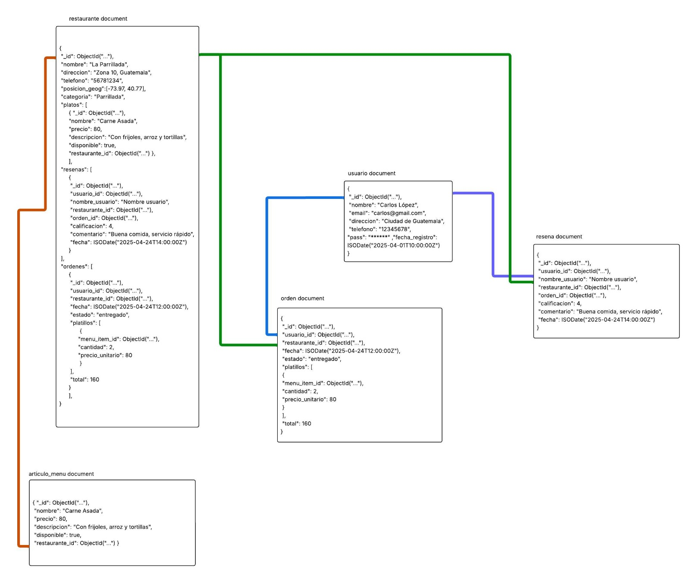

# Modelo



## **restaurante**

**Atributos:**

* `_id`: ObjectId
* `nombre`: string
* `direccion`: string
* `telefono`: string
* `posicion`: array (float)
* `categoria`: string

**Embebido para platos:**

* `_id`: ObjectId
* `nombre`: string
* `precio`: number
* `descripcion`: string
* `disponible`: boolean
* `restaurante_id`: ObjectId

**Embebido para resenas:**

* `_id`: ObjectId
* `usuario_id`: ObjectId
* `nombre_usuario`: string
* `restaurante_id`: ObjectId
* `orden_id`: ObjectId
* `calificacion`: number
* `comentario`: string
* `fecha`: ISODate

**Embebido para ordenes:**

* `_id`: ObjectId
* `usuario_id`: ObjectId
* `restaurante_id`: ObjectId
* `fecha`: ISODate
* `estado`: string

**Subembebido en ordenes (platillos):**

* `menu_item_id`: ObjectId

* `cantidad`: number

* `precio_unitario`: number

* `total`: number

**Índices:**

1. **Índice simple:**  

   ```js
   db.restaurante.createIndex({ nombre: 1 })
   ```

   > Búsqueda rápida por nombre del restaurante.

2. **Índice de texto:**  

   ```js
   db.restaurante.createIndex({ nombre: "text", categoria: "text" })
   ```

   > Para búsquedas de texto en nombre y categoría.

3. **Índice simple por nombre de plato (embebido en `platos`):**

   ```js
   db.restaurante.createIndex({ "platos.nombre": 1 })
   ```

   > Para filtrar o buscar por nombre de platillo dentro del restaurante.

4. **Índice simple por disponibilidad del plato:**

   ```js
   db.restaurante.createIndex({ "platos.disponible": 1 })
   ```

   > Para encontrar platos disponibles rápidamente.

5. **Índice simple por calificación de reseñas:**

   ```js
   db.restaurante.createIndex({ "resenas.calificacion": -1 })
   ```

   > Útil para ordenar o filtrar por calificaciones altas/bajas.

6. **Índice simple por fecha de reseñas:**

   ```js
   db.restaurante.createIndex({ "resenas.fecha": -1 })
   ```

   > Para mostrar las reseñas más recientes primero.

7. **Índice simple por estado de órdenes:**

   ```js
   db.restaurante.createIndex({ "ordenes.estado": 1 })
   ```

   > Para filtrar órdenes por estado (e.g., "entregado", "pendiente").

8. **Índice simple por fecha de órdenes:**

   ```js
   db.restaurante.createIndex({ "ordenes.fecha": -1 })
   ```

   > Para ordenar las órdenes por fecha, útil en reportes o dashboards.

9. **Índice geoespacial:**

   ```js
   db.restaurante.createIndex({ posicion: "2dsphere" })
   ```

   > Para realizar búsquedas geográficas (por ubicación) usando coordenadas \[longitud, latitud].

1. **Índice simple por `resenas.usuario_id`:**

   ```js
   db.restaurante.createIndex({ "resenas.usuario_id": 1 })
   ```

   > Para obtener reseñas de un usuario específico.

1. **Índice simple por `resenas.orden_id`:**

   ```js
   db.restaurante.createIndex({ "resenas.orden_id": 1 })
   ```

   > Para encontrar la reseña relacionada a una orden.

1. **Índice simple por `ordenes.usuario_id`:**

   ```js
   db.restaurante.createIndex({ "ordenes.usuario_id": 1 })
   ```

   > Para consultar todas las órdenes hechas por un usuario.

## **articulo_menu**

**Atributos:**

* `_id`: ObjectId
* `nombre`: string
* `precio`: number
* `descripcion`: string
* `disponible`: boolean
* `restaurante_id`: ObjectId (referencia a restaurante)

**Índices:**

1. **Índice compuesto:**  

   ```js
   db.menu.createIndex({ restaurante_id: 1, disponible: 1 })
   ```

   > Para listar artículos disponibles por restaurante.

2. **Índice de texto:**  

   ```js
   db.menu.createIndex({ nombre: "text", descripcion: "text" })
   ```

   > Permite búsquedas por nombre y descripción del platillo.

## **usuario**

**Atributos:**

* `_id`: ObjectId
* `nombre`: string
* `email`: string
* `direccion`: string
* `telefono`: string
* `contra`: string
* `fecha_registro`: ISODate

**Índices:**

1. **Índice compuesto:**  

   ```js
   db.usuario.createIndex({ nombre: 1, direccion: 1 })
   ```

   > Mejora búsquedas por nombre y ubicación.

## **orden**

**Atributos:**

* `_id`: ObjectId
* `usuario_id`: ObjectId (referencia a usuario)
* `restaurante_id`: ObjectId (referencia a restaurante)
* `fecha`: ISODate
* `estado`: string
* `platillos`: array de objetos con:
  * `menu_item_id`: ObjectId (referencia a articulo_menu)
  * `cantidad`: number
  * `precio_unitario`: number
* `total`: number

**Índices:**

1. **Índice compuesto:**  

   ```js
   db.orden.createIndex({ usuario_id: 1, fecha: -1 })
   ```

   > Consultas por órdenes recientes de un usuario.

2. **Índice multikey (por array):**  

   ```js
   db.orden.createIndex({ "platillos.menu_item_id": 1 })
   ```

   > Mejora consultas por items de menú en pedidos.

Aquí tienes el esquema actualizado de la colección **resena**, incluyendo el nuevo atributo `nombre_usuario`:

---

## **resena**

**Atributos:**

* `_id`: ObjectId
* `usuario_id`: ObjectId (referencia a usuario)
* `nombre_usuario`: string
* `restaurante_id`: ObjectId (referencia a restaurante)
* `orden_id`: ObjectId (referencia a orden)
* `calificacion`: number
* `comentario`: string
* `fecha`: ISODate

**Índices:**

1. **Índice compuesto:**

   ```js
   db.resena.createIndex({ restaurante_id: 1, calificacion: -1 })
   ```

   > Consultas por calificaciones de un restaurante.

2. **Índice simple:**

   ```js
   db.resena.createIndex({ usuario_id: 1 })
   ```

   > Para ver reseñas hechas por un usuario.

3. **Índice simple:**

   ```js
   db.resena.createIndex({ nombre_usuario: 1 })
   ```

   > Para buscar reseñas por nombre de usuario (útil si no usas el `usuario_id` directamente).
